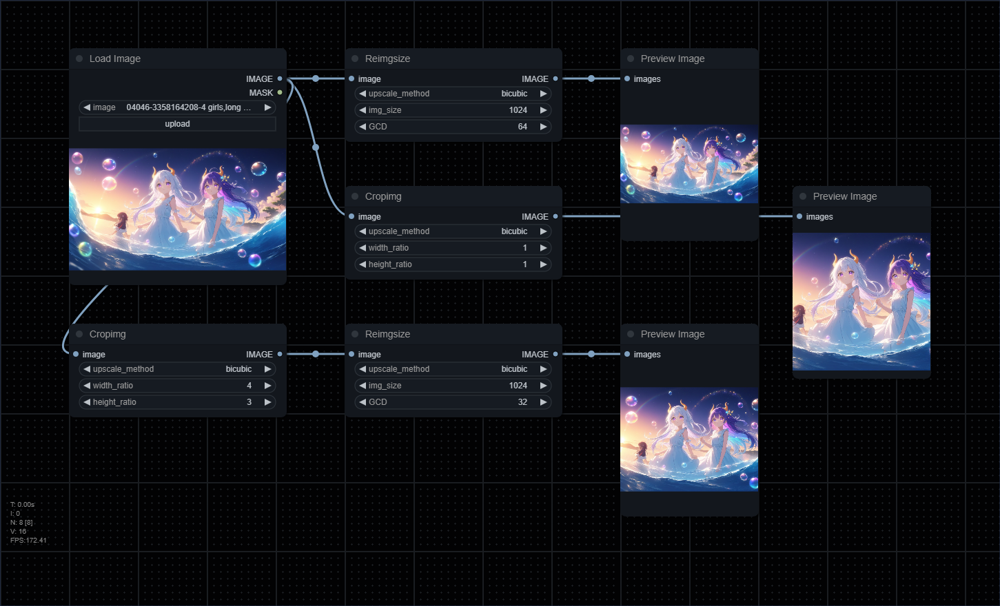

# comfyui_reimgsize
a simple reimgsize node(s) in comfyui | 一个简单的comfyui重载图像大小节点

[中文](README_CN.md)

## Description
A simple ComfyUI node for scaling an image to a specified pixel size and standardizing the resolution to a multiple of a given GCD.

## Features
- Resize images to a specified resolution
- Maintain the original aspect ratio/Adjust to the given aspect ratio
- Ensure dimensions are multiples of GCD(most cases 32 or 64)

## Example


## Installation
Clone the repository to `custom_nodes`:
```
git clone https://github.com/MakkiShizu/comfyui_reimgsize.git
```
nodes path：
- image/Reimgsize
- image/Cropimg

#### License
This project is licensed under the MIT License.
<hr>
