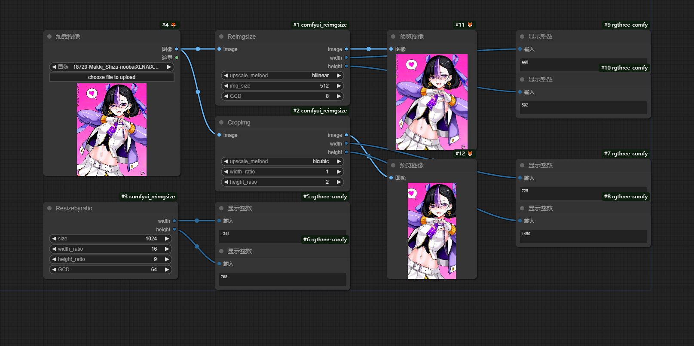

# comfyui_reimgsize

simple image resize node(s) in comfyui | 简单的comfyui节点用于重载图像大小

[简体中文|[English](README.md)]

## 简介

一些简单的 ComfyUI 节点，用于将图像缩放到指定的**像素量总和**，并将分辨率标准化为给定 GCD 的倍数。

该储存库不针对图像具体的长宽数值，而是更侧重于调整图像的**总像素量、边长的规范以及尺寸比例**。

## 作用

- 将图像总分辨率调整到指定分辨率^2
- 保持原有宽高比/调整至给定宽高比
- 确保分辨率是GCD（通常是32或64）的倍数

## 例子



## 安装

到ComfyUI文件夹目录下的 `custom_nodes` 后执行以下命令：

```
git clone https://github.com/MakkiShizu/comfyui_reimgsize.git
```

使用时节点位置：

- image/Reimgsize
- image/Cropimg
- utils/Resizebyratio

#### 许可证

该项目使用MIT许可证。

<hr>
